# SaveUp — Smart Energy Insight Node

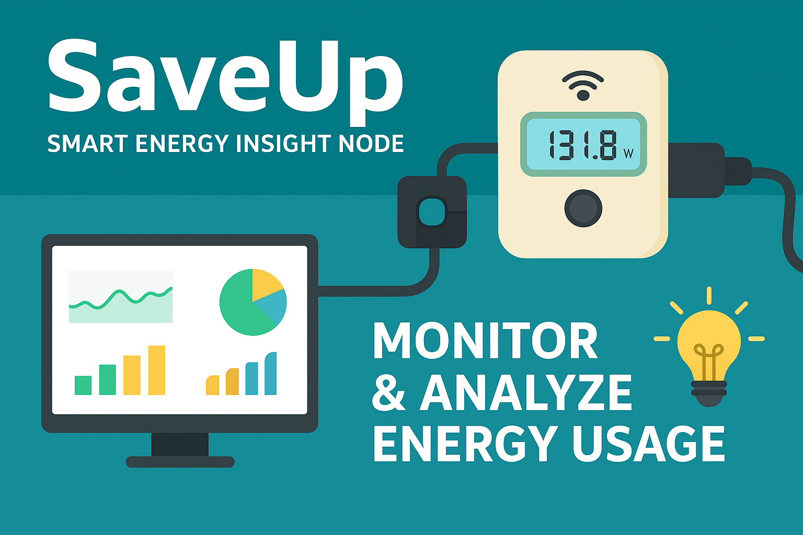  
*Reduce wasted electricity — monitor appliances, detect faults locally using TinyML, and get real-time alerts with ThingsBoard.*

---

## Edge Impulse Public Project Link:
[Public Link](https://studio.edgeimpulse.com/public/840444/live)

## Important Note 
This project began on November 20th, 2025, and was officially submitted to the Edge AI Contest by Edge Impulse on November 30th, 2025. Given the extremely tight development timeline, achieving full accuracy and complete system integration was challenging. Nevertheless, the project is currently around 80% functional, and this documentation provides a clear, step-by-step guide for replicating the entire solution.

Several areas have been identified for future improvement, including:
- Retraining the ML model with a larger and more representative real-world dataset
- Adding enhanced safety features and robust battery-management circuitry
- Designing a protective enclosure
- Creating a dedicated PCB for the final hardware
- Advancing the system toward a production-ready form factor

These improvements will significantly increase the reliability, efficiency, and overall product value.

## Elevator Pitch
Nigeria’s power crisis has become a daily math problem nobody wants to solve.
Tariffs climbed, prepaid meters drain faster than people can say “unit don finish,” and every home, shop, hostel, and small business is now playing blindfolded hide-and-seek with their own appliances. Something is consuming power — but nobody knows what. Even engineers spend weeks probing circuits, guessing loads, swapping batteries, and upsizing solar components, only to walk away without real answers.

But imagine if the guessing stopped.

SaveUp steps into the chaos as a tiny, affordable plug- or circuit-level IoT node built for the real messiness of Nigerian electricity. It measures voltage, current, power, and environmental conditions with precision, then uses on-device TinyML — trained on Edge Impulse — to detect abnormal behavior instantly. No stable internet required. No cloud lag. The intelligence lives on the device.

When SaveUp spots standby waste, a failing freezer, an overloaded socket, or an appliance quietly gulping units, it flags it and reports to a ThingsBoard dashboard that’s simple enough for households and powerful enough for technicians. People finally know what to unplug. Engineers finally see what’s actually wrong. Solar installers stop guessing and start optimizing.

And while the problem is local, the innovation speaks globally:
It’s a scalable, edge-AI energy intelligence node built for the world’s hardest electrical environments — places where power is unstable, internet is unreliable, and every watt counts.

SaveUp turns energy awareness into energy savings, one plug at a time, proving that meaningful climate-tech doesn’t always need to be expensive… sometimes it just needs to be smart.

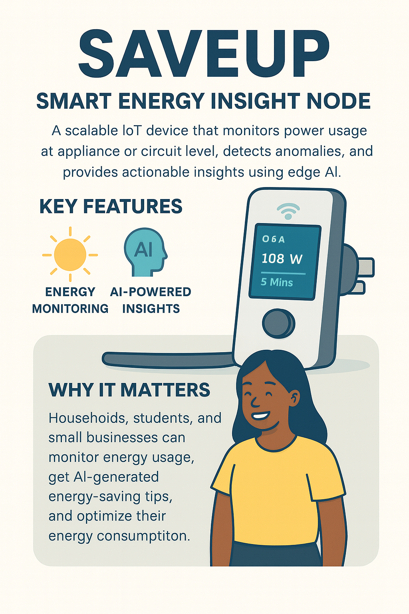 

---

## Contents (this README)
1. Project story & high-level flow  
2. Hardware & BOM  
3. Circuit / wiring & safety notes (Stage 1) 
4. Firmware & calibration (Stage 2–3)  
5. ThingsBoard integration (Stage 4)  
6. Dataset & Edge Impulse pipeline (Stage 5)  
7. Model training & deployment details  
8. How it behaves in the real world — demo & screenshots  
9. What to add next + contributions  
10. Quick start & flash instructions  
11. License & credits

---

# 1. Project story & flow (start → finish)
**Problem:** electricity costs are high and power is unreliable in Africa. Appliances waste energy due to standby losses or failing components (fridges, motors). Most people don't have appliance-level visibility.

**Solution:** SaveUp — a small IoT node that:
- measures voltage, current, temperature, humidity,
- computes Vrms, Irms, Pavg, PF, and accumulates Wh,
- runs a TinyML anomaly detector on the raw waveform locally (Edge Impulse),
- publishes telemetry and anomaly flags to ThingsBoard for charts, alerts, and remote relay control.

**High-level flow (visual story):**
1. Sensors → raw ADC → sampling at **2 kHz**.  
2. Short-window processing (400 samples = 0.2 s) → Vrms/Irms/Pavg.  
3. Parallel: window samples added to EI buffer → inference run via `run_classifier()` → anomaly score.  
4. Telemetry JSON published to ThingsBoard: `{ Vrms, Irms, Pavg, PF, Wh, Temp, Hum, anomaly, anomaly_score }`  
5. ThingsBoard dashboard shows live charts, cost widgets, and alarms; can send RPC `setRelay` to the node.

(Insert animated GIF showing flow: sensor → device → ThingsBoard dashboard.)  
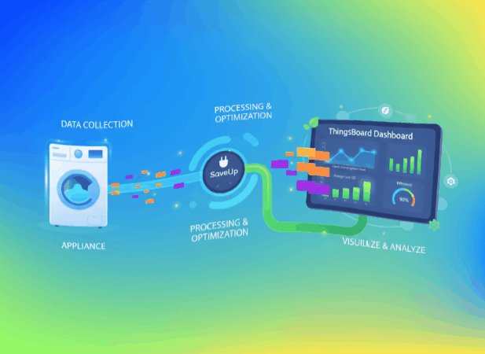

---

# 2. Hardware design & prototype
## Chosen hardware & why
- **Arduino Nano RP2040 Connect** — RP2040 performance + WiFi (good memory & community support. One can use better hardwares fromArduino, ESP, Raspberry Pi, etc.)  
- **ACS712-05A** — affordable current sensor (±5 A) suitable for single-appliance loads (use appropriate variant, such as ACS712-20A (better choice but wasn't available at the time of this project) if expecting higher current).  
- **ZMPT101B** voltage sensor** — small board for AC voltage sensing (isolation via transformer module). Also the best choice for this project.  
- **DHT11** — temperature & humidity (simple context. Choose DHT22 for a better result).  
- **5V Relay Module** — control/remote power cutoff.  
- **I2C LCD (0x27)** — quick local feedback.  
- **Misc: perfboard, fuse, mains-rated wires, connectors.**

> Why these: low-cost, easy to source locally, fits contest budget and is adequate for prototyping.

## Bill of Materials (BOM) — example
| Qty | Component | Purpose | Approx price (₦) | Notes / Supplier/ online |
|---:|---|---:|---:|---|
| 1 | Arduino Nano RP2040 Connect | MCU + Wi-Fi | 15,000–20,000 | Ossy Solar Ltd ([Amazon](https://www.amazon.com/Arduino-Nano-RP2040-Connect-Headers/dp/B095J4KFVT)) |
| 1 | ACS712-05A | Current sensing ±5A | 2,500 | Ossy Solar Ltd ([Amazon](https://www.amazon.com/acs712-current-sensor/s?k=acs712+current+sensor))|
| 1 | ZMPT101B | Voltage sensor | 5,000 | Ossy Solar Ltd ([Amazon](https://www.amazon.com/s?k=ZMPT101B&crid=1DMJSYMZLP4S&sprefix=zmpt101b%2Caps%2C675&ref=nb_sb_noss_1))|
| 1 | DHT11 | Temp & humidity | 1,500 | Ossy Solar Ltd ([Amazon](https://www.amazon.com/s?k=DHT11&crid=1ZWCZBVA2YP4B&sprefix=dht11%2Caps%2C392&ref=nb_sb_noss_1)) |
| 1 | Relay module (5V) | Remote on/off | 1,500 | Ossy Solar Ltd ([Amazon](https://www.amazon.com/s?k=Relay+module+%285V%29&crid=3BWZQ8MPK3IVY&sprefix=relay+module+5v+%2Caps%2C690&ref=nb_sb_noss_2)) |
| 1 | 5V PSU adapter | Board power | 1,000 | Ossy Solar Ltd ([Amazon](https://www.amazon.com/s?k=5V+PSU+adapter&crid=2HO46EON9DOCR&sprefix=5v+psu+adapter%2Caps%2C363&ref=nb_sb_noss)) |
| misc | Wires, connectors, fuse, enclosure | — | 6,000 | Ossy Solar Ltd |
| **Total** |  |  | **~₦24,000–29,000** | |

## Circuit & wiring (Stage 1)
**Important**: use fuses, insulated connectors, and keep mains wiring to a board with proper isolation. If unsure, ask a qualified electrician.

Assumptions: Mains = 230 VAC, 50 Hz (Nigeria). Use the ACS712 in series with live/hot conductor only.

## Hardware wiring
- **High-level**: Live (mains) → Fuse → **Relay** (COM) → Load (NO on relay) → Neutral.
- Place **ACS712** in series on the live conductor between fuse and load (or between COM and NO depending on layout).
- **ZMPT101B** module: connect module input across Live and Neutral (module provides isolated low-voltage AC output). Connect module output to RP2040 ADC through bias circuit if needed (ZMPT usually outputs AC centered around 0V — check module docs).
- **ACS712**: VCC = 5 V (or 5 V supply if sensor needs 5 V), GND = common ground with MCU, OUT → MCU ADC (through biasing circuit). ACS712 output at 0 A = VCC/2.
- **DHT11**: VCC = 5 V (or 3.3 V if module supports), DATA → RP2040 digital pin (with 4.7k–10k pull-up if required).
- **I²C LCD**: SDA/SCL → RP2040 SDA/SCL (I²C pins), VCC 5 V or 3.3 V depending on module; level-shift if needed.
- **RP2040 ADC**: ADC inputs expect 0–3.3 V. Do not feed >3.3 V. Use level shifting or scaling if required.
- **Common ground**: keep MCU ground and sensor grounds common; but be mindful ZMPT101B provides isolation at module level — treat carefully.

### Pin (Arduino sketch-level):

- ACS712 OUT → A0 (ADC)
- ZMPT101B OUT → A1 (ADC)
- DHT11 DATA → D2
- Relay IN → D3 (use a transistor/optocoupler if module is not opto)
- LCD I²C → SDA/SCL (pins on Nano RP2040 Connect)

**Schematic (visual)**: 
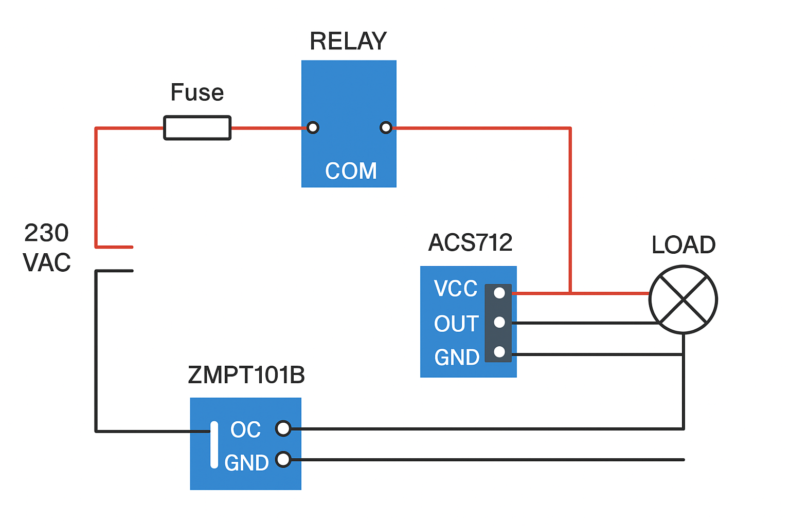
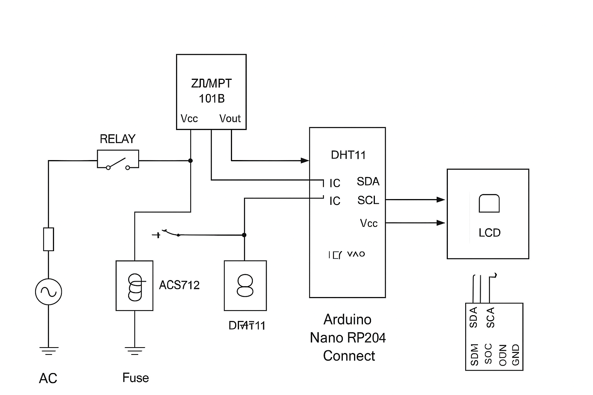
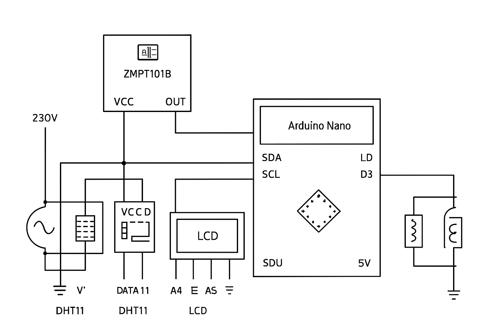

**Soldering & prototyping**
- Steps: prepare perfboard, place modules, secure ACS712 with isolation, solder I2C lines for LCD, secure wires inside heat-shrink tubing, mount relay.


---

# 3. Firmware (Stage 2–3 summary)
## What the firmware does (v1.0-alpha)
- 2 kHz sampling (blocking window of 400 samples = 0.2 s).  
- ADC → convert to volts with `ADC_TO_V`. Subtract bias `Vbias` / `Ibias`.  
- Compute: `Vrms`, `Irms`, `Pavg`, `PF`, `Wh` accumulation.  
- DHT11 read on `D2` and I2C LCD at `0x27`.  
- MQTT to ThingsBoard: sends JSON telemetry periodically.
- Edge Impulse inference runs on buffered window and sets `anomaly` flags.  
- RPC `setRelay` supported for remote switching.

## Calibrate: bias & scale
**Calibration script** (serial mode) measured these:
Vbias = 1.449729f
Ibias = 2.305866f
VOLTAGE_SCALE = 227.540139771
CURRENT_SCALE = 0.264412100

**How to calibrate (summary):**
1. No-load bias (device offline from load) → measure ADC average for V and I → set `Vbias` and `Ibias`.  
2. Put calibrated multimeter on mains → read Vrms → compute `VOLTAGE_SCALE = Vrms_meter / Vrms_device`.  
3. Place known load or use clamp meter → compute `CURRENT_SCALE = Irms_meter / Irms_device`.

**Calibration script**: (path) `SaveUp_Calibration_v1/SaveUp_Calibration_V1.ino` — runs interactive serial prompts and prints CSV of calibration constants.

## Libraries to install
- WiFiNINA  
- PubSubClient  
- ArduinoJson (v6.x)  
- DHT sensor library  
- LiquidCrystal_I2C  
- Edge Impulse Arduino ZIP (the `./ei-anomaly-detection-arduino-1.0.1.zip`)

## Where to find firmware
- `Final_firmware_Version_1.0-alpha/Final_firmware_Version_1.0-alpha.ino` (main sketch)  
- `SaveUp_Calibration_v1/SaveUp_Calibration_V1.ino` (bias & scale calibration helper)  
- `firmware/measurement_only.ino` (minimal stable sampling for data collection)

All within this repo

---

# 4. ThingsBoard & IoT integration (Stage 4)
## Steps (simple)
1. Create ThingsBoard Cloud or local account: **ThingsBoard Cloud** (or your host).  [Link](https://thingsboard.cloud/dashboards/all/ed478400-cc37-11f0-8d27-9f87c351edd8)
2. Create Device: `SaveUp Device` → copy Access Token.  
3. Update `ACCESS_TOKEN` in firmware and upload.  
4. Device publishes to MQTT topic: `v1/devices/me/telemetry`.  
5. Create Dashboard → add widgets (Vrms, Irms, Pavg, PF, Temp/Hum, Wh aggregates, Relay control).  

## Manual Widget Creation (For the Dashboard)
1) Vrms Line Chart
- Dashboard → Edit → Add widget → Charts → Line Chart
- Datasource: Device → select your SaveUp device → Keys → add Vrms
- Aggregation: None (raw)
- Time window: last 5 min (for live)

Save, place top-left.

2) Irms Line Chart
- Same as above but key Irms.

3) Pavg Gauge
- Widget: Gauges → Donut / Linear gauge
- Datasource key: Pavg
- Units: W
- Min: 0, Max: pick e.g. 2000 or adjust to expected loads

4) Power Factor Gauge
- Key: PF, min 0, max 1.

5) Temp & Humidity Dual Line
- Widget: Charts → Line Chart (multi-series)
- Keys: Temp and Hum.

6) Daily/Weekly Wh
- Widget: Aggregations → Time Series bar
- Datasource: Wh with aggregation SUM.

Configure time window to 1 day and 7 days respectively.

7) Cost Widget (Daily & Weekly)
- Add a Card widget. Use the widget’s settings to:
- Data source: timeseries Wh with SUM and time window 1 day (for daily).
- In the content/template field put a formula to compute cost, or use a script in the widget to compute:
    cost = (Wh_sum / 1000) * TARIFF_NAIRA_PER_KWH

Replace TARIFF_NAIRA_PER_KWH with your local tariff (e.g., 250 ₦/kWh).

Repeat for weekly.

**Tip**: ThingsBoard lets you use Liquid templates or JS inside some widgets to compute derived values. Use that if you want the dashboard to compute cost live.

8) Relay Control (Switch)
- Add widget → Controls → Switch
- Configure as an RPC control:
- Method: setRelay
- Params: raw true/false (or JSON { "state": true } depending on the firmware parsing)
- When toggled, ThingsBoard will publish RPC to v1/devices/me/rpc/request/<id>; your device must be subscribed (the firmware already subscribes).

9) Alarm Widget
- Add built-in Alarm widget to view generated alarms.


6. Create Rule Chain: monitor telemetry → create Alarm nodes (Overcurrent, Low PF, High Temp, anomaly flag) → Email/SMS/Webhook actions (optional).

##Rule Chain: Create Alert Rules & Actions
- Add simple nodes to the Root Rule Chain (or create a new Rule Chain and link it). The basic flow for each rule:
- Telemetry → Script Filter Node → Generate Alarm Node → Send Email/Webhook Node

### Create a Rule Chain (recommended)
Rule Chains → + Add new Rule Chain → name SaveUp Alerts

- Open SaveUp Alerts and Drag nodes as below:
    Node A — Input
    Msg Type Switch (or use default Originator Type = Device Telemetry)

    Node B — Script (filter for overcurrent)
    Script type node (JavaScript)
    Script:
        // payload example: { "Irms": 1.23, "PF": 0.98, "Temp": 30 }
        var data = msg;
        if (data && data.Irms && (data.Irms > 6.0)) {
        // forward the message and attach alarm metadata
        metadata.alarmType = "OVER_CURRENT";
        metadata.severity = "CRITICAL";
        metadata.details = "Irms="+data.Irms;
        return { msg: msg, metadata: metadata, msgType: msgType };
        }
        return null;

    Set output to next node on true.

    Node C — Create Alarm
    Create Alarm node: configure:  
    Alarm type: OVER_CURRENT    
    Severity: CRITICAL
    Propagate originator = true

    Node D — Email / Webhook
    Email node: configure SMTP settings in ThingsBoard (Admin → System Settings) or Webhook node to call an external service (SMS/WhatsApp API).
    
    Connect Create Alarm → Email/Webhook.

    Node E — RPC Action (optional)
    To automatically open relay when overcurrent is detected (careful): add RPC Call node that sends a one-way RPC to the device:
    Topic: v1/devices/me/rpc/request/1  
    Payload: {"method":"setRelay","params":false}

    Repeat the above with Script nodes for:

    PF low: if (data.PF && data.PF < 0.5) { ... }
    Temp high: if (data.Temp && data.Temp > 60) { ... }
    anomaly flag: if (data.anomaly === true) { ... }

    Important safety note: Auto-cutoff RPCs can be powerful — for testing use reduced thresholds and confirm you can remotely re-enable only after manual inspection.

## ThingsBoard telemetry format (example)
```json
{
  "Vrms": 230.45,
  "Irms": 0.432,
  "Pavg": 99.34,
  "PF": 0.98,
  "Wh": 12.345,
  "Temp": 29.1,
  "Hum": 55.2,
  "anomaly": true,
  "anomaly_score": 0.82
}
```

- Control (RPC)
To remotely toggle relay: from ThingsBoard widget or REST API use RPC method setRelay with params true/false.

## Find the JSON files for dashboard and rule chain:
- Dashboard - (`/Dashboard.json`)
- Rule Chain - (`./RULE CHAIN.json`)

## Images from ThingsBoard Set Up:
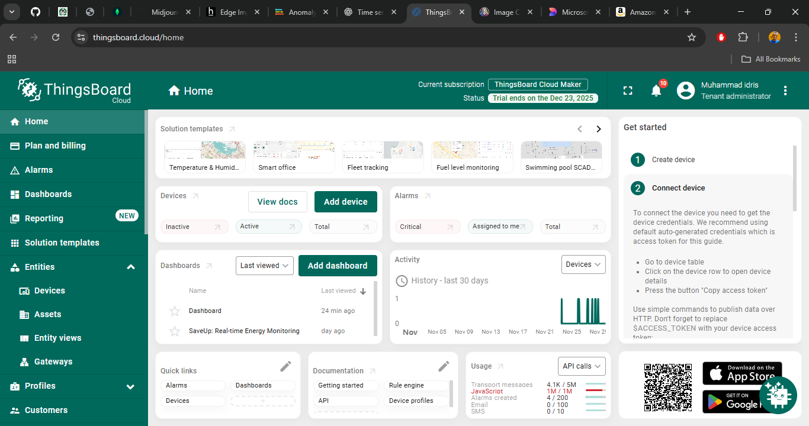
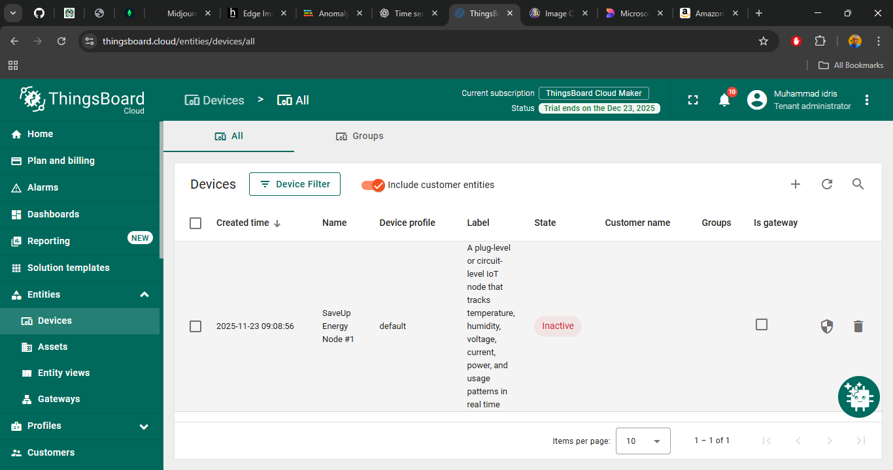
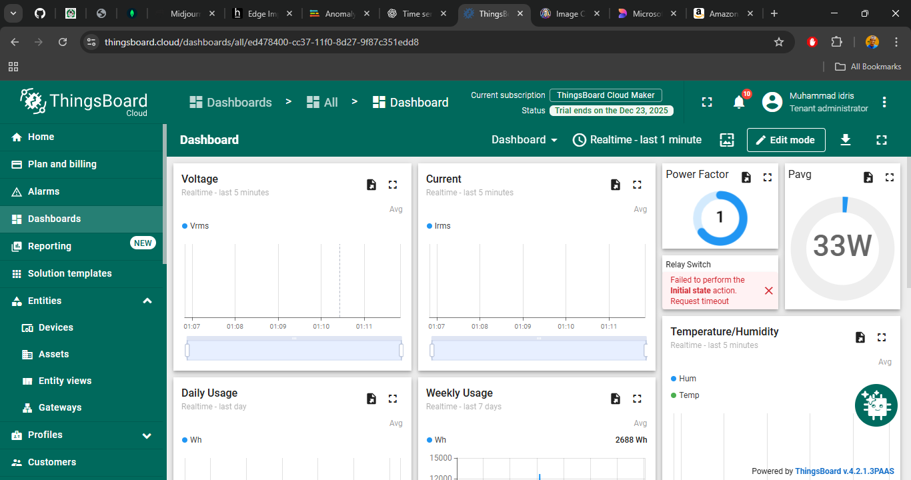
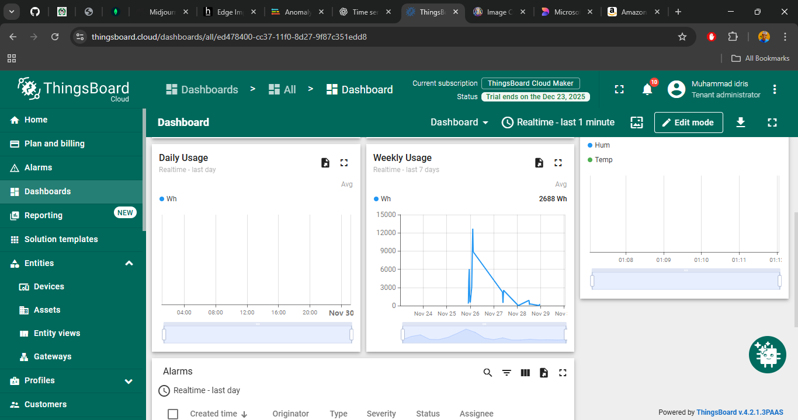
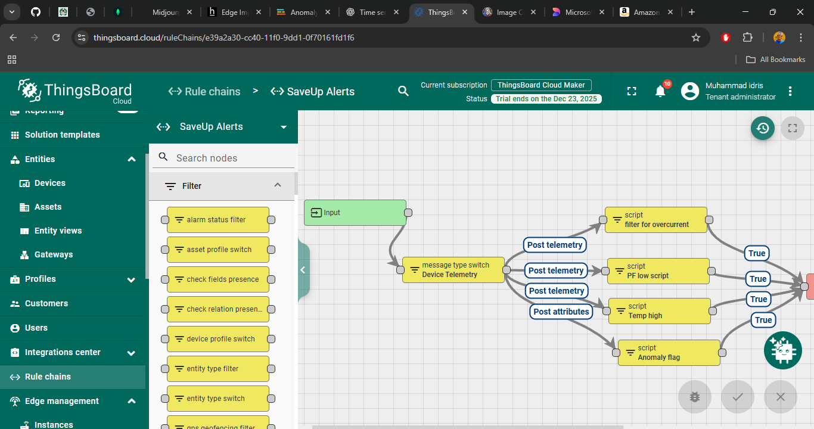
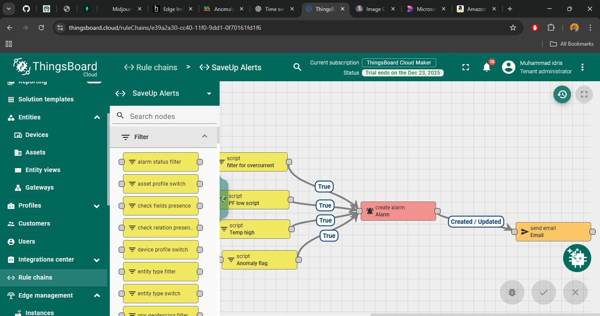

# 5. Dataset & Edge Impulse pipeline (Stage 5)
## Dataset collection
### Strategy and produced dataset
- What I collected: generated synthetic-ish time series derived from logged device samples (8 "normal" datasets, each 1 minute long) because time was limited.
- Channels captured: voltage, current (both sampled at 2000 Hz).
- Windowing: 400-sample windows (0.2 s), overlap 200 (50%).
- Labeling: normal for training anomaly detector; optional test anomaly files for evaluation if you can simulate faults.

### Curation & tips
- Include: different loads, seasons (temp), times of day, generator vs mains, powering cycles of compressor, motor startup ramps, standby modes.
- More data = better model generalization. For anomaly detection: lots of normal data (hours if possible). For supervised classifier: balanced labeled sets for each class.

**Note**: synthetic datasets are OK for prototyping but may not generalize to real-world faults.

## Images  from Data Collection:
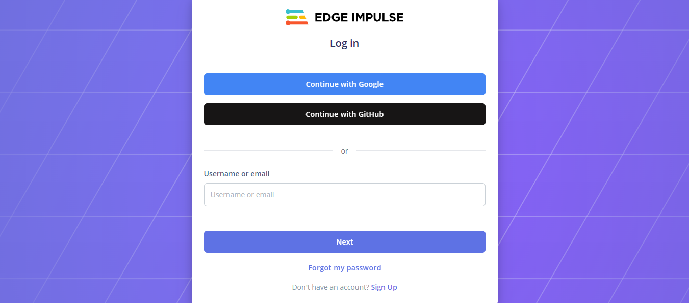
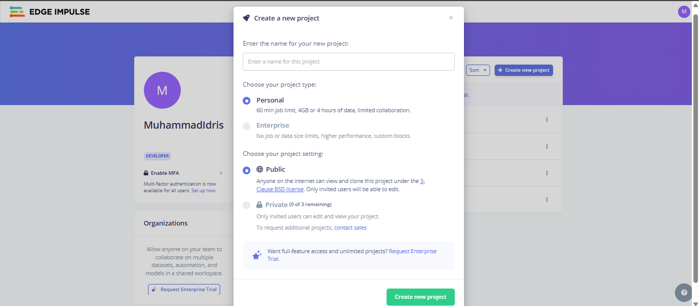
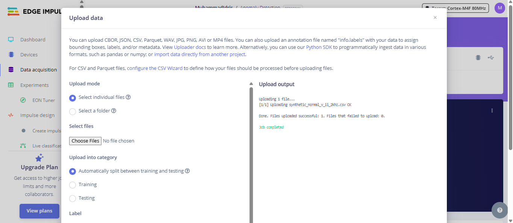
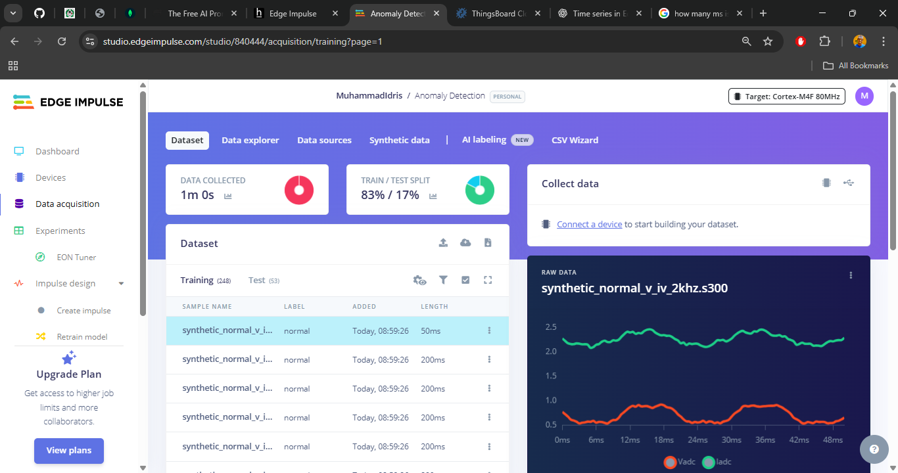

# 6. Pipeline creation (Edge Impulse)
## Impulse settings (recommended)
- Click on create impulse
- Sampling rate: 2000 Hz
- Window size: 400 samples (0.2 s)
- Window increase: 200 (50% overlap)
- DSP blocks: Raw + Spectral (FFT size 256) + optional statistical features
- Learning block: Anomaly detection (autoencoder / EI anomaly block)

## Why these choices
- 2 kHz captures mains waveform plus harmonics and transients important for motor faults.
- 0.2 s window aligns with multiple mains cycles (10 cycles @50 Hz) giving consistent RMS measurements and transient detection.
- FFT helps detect new harmonics from bearing faults or compressor issues.
- Anomaly detector is ideal when you lack many labeled fault examples.

## Images  from Impulse creation


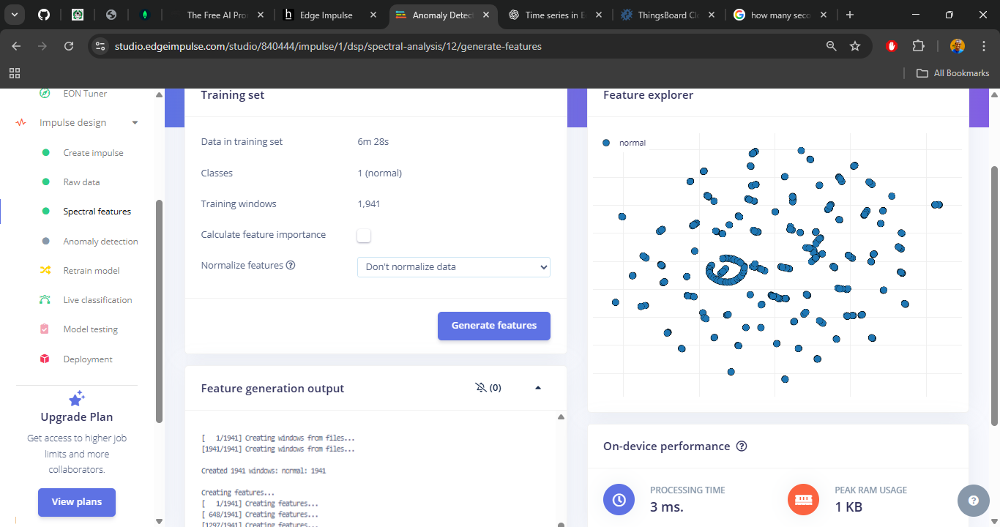

# 7. Model training
Train anomaly detector (start with default network); monitor AUC and ROC.
- Click Train model (Anomaly).
- Choose training options (leave defaults for first run).
- Click Start training — this may take a few minutes depending on model size chosen.

**What to watch:**
- Edge Impulse will report training loss and validation metrics. For anomaly detectors you'll see ROC/AUC or detection thresholds.
- If training fails due to insufficient data, upload more normal samples.

Tune model size, quantization (int8) and try to keep RAM < 64 KB and Flash < 200–300 KB.

## Why chosen settings
- Anomaly detection chosen because of limited labeled fault data and because it flags previously unseen abnormal patterns.
- Quantization to int8 was chosen to reduce memory footprint for on-device inference.

## Images  from Model Training

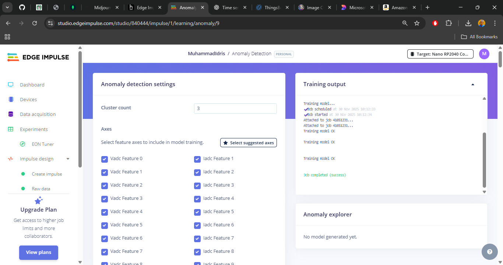
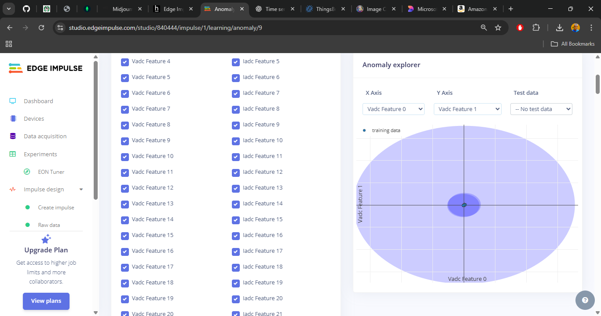
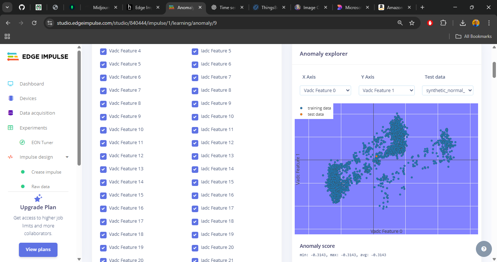

# 8. Testing & deployment
## Export & integration
- Export: Arduino library from Edge Impulse (zip).
- Install via Arduino IDE → Include .ZIP Library.
- Integrate run_classifier() flow into firmware. Use signal_t with get_data function that copies samples from a live circular buffer.

## Why Arduino library/TFLite?
- Arduino library from EI wraps TFLite Micro and simplifies sample buffer handling — fastest to integrate.
- RP2040 has enough resources; the Arduino export will be quantized and small enough.

## Validation checklist
- Confirm inference on known test windows in Edge Impulse Studio matches on-device inference.
- Verify telemetry anomaly and anomaly_score land in ThingsBoard and trigger Rule Chain alarms.
- Test RPC control from ThingsBoard and safety trip behavior.

# 9. Real-world demos & visuals
## What SaveUp does in the field
- Live dashboards show Vrms/Irms/time-series + Wh totals.
- When an anomaly is detected (bearing fault / compressor failure / standby losses), device sets anomaly=true and sends anomaly_score.
- Rule Chain can raise an alarm and optionally cut power via relay (auto-shutdown on severe faults).


### Wiring + soldering GIF 


### Dashboard live chart GIF 
<iframe width="560" height="315" src="https://drive.google.com/file/d/1hs2bJmc9Yy_GS-9_a4vhEnoFF1ux6UFD/view?usp=drive_link" frameborder="0" allow="accelerometer; autoplay; clipboard-write; encrypted-media; gyroscope; picture-in-picture" allowfullscreen></iframe>

### Demo of anomaly detection on device serial logs 
<iframe width="560" height="315" src="https://drive.google.com/file/d/1K-HEXwurrjPs-uSjK6AqvI_mq2wXUg4D/view?usp=drive_link" frameborder="0" allow="accelerometer; autoplay; clipboard-write; encrypted-media; gyroscope; picture-in-picture" allowfullscreen></iframe>


Here are strong **Notes & Next Steps** you can add to your documentation, covering engineering, ML, IoT, and product-level improvements.

---

# **📌 Notes & Next Steps (Recommended Section for README)**

## **General Notes**

* This project currently implements **power monitoring**, **auto lighting control**, **IoT telemetry**, and an **Edge Impulse anomaly detection model** for detecting abnormal electrical patterns.
* Synthetic datasets were used due to time constraints. While sufficient for demonstrating functionality, *real-world data collection will significantly improve model reliability*.
* The Nano RP2040 Connect offers WiFi and an onboard IMU, meaning this project can potentially do much more (multi-sensor fusion, vibration monitoring, power quality analysis, etc.).

---

# **🚀 NEXT STEPS (Technical + Product Roadmap)**

## **1. Collect Real, High-Quality Dataset**

To move from prototype → production:

* Capture **hours** of real voltage/current waveforms.
* Record multiple conditions:

  * Normal operation at various loads
  * Faults (over-voltage, over-current, unstable supply, loose connections, etc.)
  * Different appliances
* Include **labelled events**: turning ON/OFF, overload, spikes.

This will dramatically increase anomaly detection reliability.

---

## **2. Expand ML Model Beyond Anomaly Detection**

Once real data is available, add supervised models:

* **Fault type classification**
  Detect:

  * Overload
  * Arc faults
  * Brownouts
  * High THD
  * Appliance signatures

* **Load identification (NILM-lite)**
  Identify which appliance is running based on V/I waveform.

* **Predictive maintenance**
  Monitor long-term current draw drift → detect device degradation.

---

## **3. Add Edge Processing Enhancements**

Add more measurement features:

* **RMS over sliding windows**
* **Frequency estimation**
* **Harmonic distortion**
* **Power factor estimation**
* **Inrush current detection**

These become great features for ML pipelines.

---

## **4. Improve IoT Dashboard (ThingsBoard)**

Enhance the visual experience:

* Add **gauge widgets** for Vrms, Irms, Pavg.
* Add **FFT visualizations** if you compute harmonics.
* Add **alert panels** with color-coded severity.
* Add **device control cards** (Lamp ON/OFF, mode switch).
* Add **historical analytics** (24h, weekly, monthly trends).

---

## **5. Advanced Rule Chains**

Add:

* **Email/SMS alerting** via Twilio/SMTP
* **Automated device shutdown** when anomalies exceed thresholds
* **Machine learning decision nodes** (via EI inference scores)
* **Alarm clearing logic** after normal behavior returns

---

## **6. Hardware Revision (if making PCB v2)**

Improve hardware reliability:

* Isolated AC measurement using:

  * ZMPT101B (voltage)
  * SCT-013-000 / ACS712 / INA219 (current)
* Add:

  * Fuse / MOV surge protector
  * Zero-crossing detector
  * EEPROM for storing calibration
  * Hardware watchdog
  * More stable voltage reference

---

## **7. OTA Updates**

Implement **Over-The-Air firmware updates**:

* Arduino IoT Cloud
* ThingsBoard OTA
* Custom HTTPS updater

This makes long-term deployment viable.

---

## **8. Local Data Storage (Offline Mode)**

Use on-board flash to buffer:

* Last 5–60 minutes of telemetry
* Anomaly occurrences
* Raw waveform snapshots

Upload when WiFi returns.

---

## **9. Improve Anomaly Detection Logic**

Right now inference outputs “normal / anomaly score.”
Next iteration:

* Buffer multiple anomaly scores
* Apply hysteresis to avoid false positives
* Trigger alerts only after **consecutive anomalies**
* Visualize anomaly score trend on dashboard

---

## **10. Add User Interaction Features**

* Physical multi-function button (reset, calibration, mode switching)
* Status LED patterns (WiFi, anomaly, error, safe mode)
* Mobile-friendly dashboard

---

## **11. Add Auto Calibration Mode**

At startup:

* Capture **Vbias** and **Ibias** automatically
* Save in settings
* Reduce user setup complexity
* Show bias values on dashboard for debugging

---

## **12. Move Towards Phase 3 – Commercial Ready Version**

* Complete enclosure design (3D printed or molded)
* Perform environmental testing
* Add FCC/CE compliance considerations
* Improve firmware robustness
* Add secure provisioning for WiFi and IoT tokens

---

# Vision
Our project solves a real problem in emerging markets: unreliable power quality and the lack of visibility into electrical faults. We built a smart energy monitoring device that measures voltage, current, and real-time usage while using TinyML to detect anomalies locally—even without internet.

It reports insights to a ThingsBoard IoT dashboard, sends alerts when detecting abnormal electrical behavior, and even controls lighting automatically based on environmental conditions.

With a scalable firmware architecture, on-device intelligence, synthetic data bootstrapping, and a clear roadmap for future supervised learning, this solution can grow into a low-cost, intelligent power safety device for homes, labs, and small businesses.

---

# Quick start (flash & run)
## Prerequisites
- Arduino IDE (latest) with RP2040 core
- Libraries: WiFiNINA, PubSubClient, ArduinoJson, DHT, LiquidCrystal_I2C
- Edge Impulse Arduino ZIP (installed)

## Steps
- Clone repo:
    git clone https://github.com/muhammad-idris24/saveup.git <br>
    cd saveup
- Open firmware/Final_firmware_Version_1.0-alpha.ino in Arduino IDE.
- Edit Wi-Fi and ThingsBoard token at top of sketch.
- Tools → Board → Arduino Nano RP2040 Connect. Choose correct port.
- Build & Upload.
- Open Serial Monitor (115200) — watch logs.
- On ThingsBoard, create device and dashboard (token used in sketch).
- For calibration: open firmware/calibrate_stage2.ino and follow prompts.
